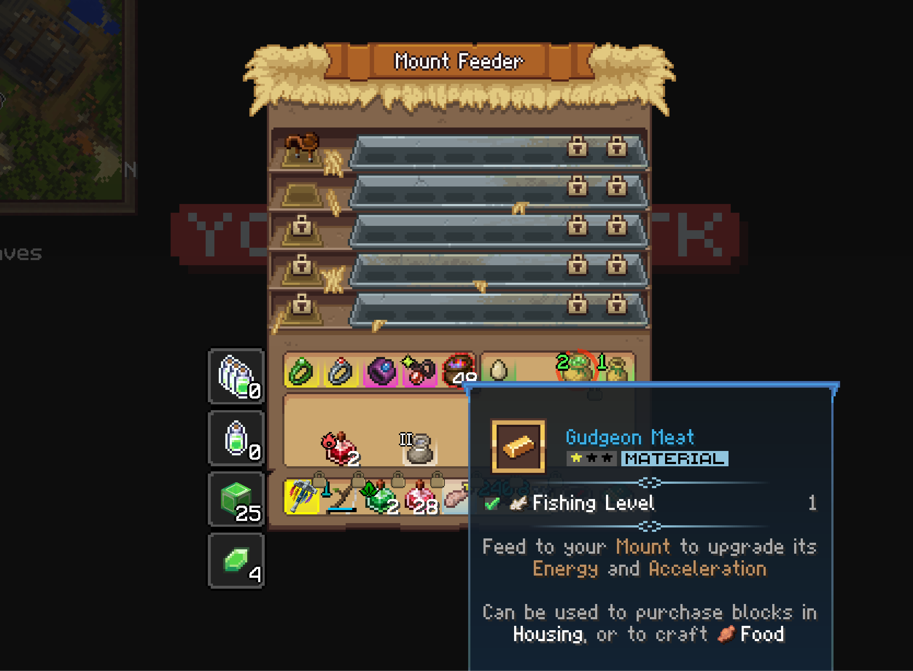
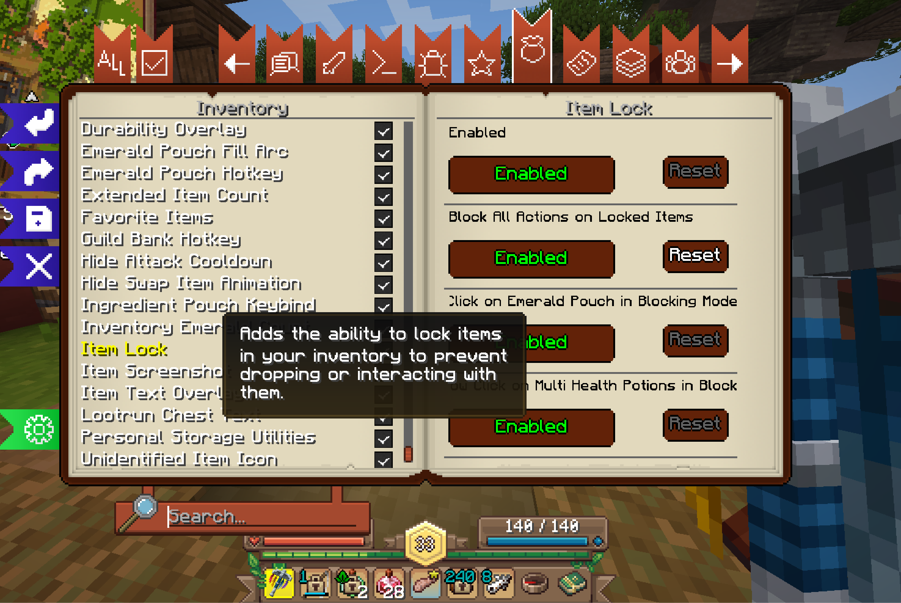

# su26-ai301-contribution
# Contribution [#]: [Allow clicking locked slots in feeder menu]

**Contribution Number:** [1]  
**Student:** [June Eguilos]  
**Issue:** [[GitHub issue link](https://github.com/Wynntils/Wynntils/issues/3860)]  
**Status:** [Phase III] [Complete]

---

## Why I Chose This Issue

[1-2 paragraphs explaining why this issue interests you, how it matches your skills/learning goals, what you hope to learn]
I really like game development and grew up on Minecraft so this project stood out to me personally. I hope to learn more on contributing to open source, then go on to tackle harder tasks/bug fixes/contributions.

---

## Understanding the Issue

### Problem Description

[In your own words, what's broken or missing?]
Seems like a small bug, when an item is locked, they just want to allow clicking locked slots in a feeder menu. 

### Expected Behavior

[What should happen?]
Allow clicking locked slots in the feeder menu. 

### Current Behavior
`[What actually happens?]`

When an item is locked, you just aren't able to interact with specific progression items, when that shouldn't be the case.

  

### Affected Components
`[Which parts of the codebase are involved?]`
`ItemLockFeature.java`

#### Setting up to reproduce Bug

1. Download Prism Launcher

2. Log into Prism Launcher

3. Modify Minecraft version to be 21.0.0

4. Download Modpack Wyntill

  

#### Setting up environment
Having to download Minecraft and Java in order to work with the modpack. 

1. Download Wynntils
2. Download Java
3. Fork git
4. Clone git in own VSCode

No challenges at all.   

### Steps to Reproduce

  

1. [Step 1]
- Play Minecraft
- Go into Server WynnCraft
- Go to any `Mount Feeder` 
- Press `I` to bring up `Wynntils User Profile`
- Click on `Settings`
- Go to `Inventory` and Click on Hover `Item Lock`
- Enable `Block All Actions on Locked Items`
- Lock the slot where your horse feed is. 
- Now go to a Horse Feeder Station in a Stable

3. [Observed result]
- You are unable to feed Horse, or click on the saddle because of the `Block All Actions on Locked Items`
  

### Reproduction Evidence

- **Commit showing reproduction:** [Link to commit in your fork]
N/A, this is a gameplay bug to reproduce. 

- **Screenshots/logs:** [If applicable]

- **My findings:** [What you discovered during reproduction]
You are unable to place your item into the feeder because it is Item Locked. 
  
---

## Solution Approach

The file that I have to modify is `ItemLockFeature`. I initially planned on just adding a boolean check, but discovered that Wynntils identifies which Wynncraft GUI is open through a `Container` system, so I needed to create a new container class to represent the Mount Feeder before I could reference it in `ItemLockFeature`.

### Analysis

The root cause is that `ItemLockFeature.onInventoryClickEvent` blocks clicks on any locked slot whenever "Block All Actions on Locked Items" is enabled, with no exception for the Mount Feeder. The feature already had exceptions carved out for two other cases (Emerald Pouch and Multi Health Potions), but the Mount Feeder wasn't one of them, so locked materials placed in the feeder (mount food, profession materials) couldn't be interacted with at all.

A secondary issue I discovered while reproducing the bug: the Mount Feeder's title isn't a normal text string. Wynncraft renders it using a custom font glyph in the Unicode private-use area (`\uDAFF\uDFED\uE058`) instead of literal "Mount Feeder" text, so simple string/regex matching on visible text wouldn't work. I had to find the actual underlying glyph sequence by logging the raw title.

### Proposed Solution

Add a new `MountFeederContainer` class so Wynntils can recognize when the player has the Mount Feeder open, then add an early-return check in `ItemLockFeature.onInventoryClickEvent` that skips the lock-blocking logic entirely when the current container is the Mount Feeder. Matching the existing pattern already used for fullscreen containers, Emerald Pouch, and Multi Health Potions.

### Implementation Plan

Using UMPIRE framework (adapted):

**Understand:** Locked items (mount food, profession materials) cannot be clicked or moved while inside the Mount Feeder GUI when "Block All Actions on Locked Items" is enabled, even though this interaction should always be allowed.

**Match:** `ItemLockFeature.java` already has two existing exceptions to the lock-blocking behavior (Emerald Pouch, Multi Health Potions), both implemented as early-return checks near the top of `onInventoryClickEvent`. The `ContainerModel` registry pattern (used by ~60 other container classes like `EmeraldPouchContainer`, `IngredientPouchContainer`) is how Wynntils identifies which Wynncraft GUI is currently open, via regex matching on the container title.

**Plan:**
1. Create `MountFeederContainer.java` extending `Container`, matching on the Mount Feeder's title pattern
2. Register the new container in `ContainerModel.registerContainers()`
3. Add an early-return check in `ItemLockFeature.onInventoryClickEvent` for `MountFeederContainer`
4. Test in-game to confirm locked items become clickable inside the feeder, and remain blocked elsewhere

**Implement:** 

**Review:** Fix is scoped narrowly to the Mount Feeder only, follows the existing code pattern for exceptions in `ItemLockFeature`, no new config options added since this should always be allowed (not toggleable), follows the project's alphabetical container registration convention

**Evaluate:** Verified manually ingame on the Wynncraft server: enabled "Block All Actions on Locked Items," locked a slot containing horse feed, opened the Mount Feeder, and confirmed I could now click/place the item. Re-tested in normal inventory afterward to confirm locked items are still blocked everywhere else.

---
## Testing Strategy

### Unit Tests

- [ ] N/A 
    — this fix is GUI/event-interaction based and was validated through manual in-game testing rather than unit tests, consistent with how the existing `ItemLockFeature` exceptions (Emerald Pouch, Multi Health Potions) are handled in the codebase

### Integration Tests

- [ ] N/A 
    — no existing integration test harness for container/click event interactions in this codebase

### Manual Testing

Tested directly on the Wynncraft server using a custom-built Fabric jar loaded via Prism Launcher:
1. Enabled "Block All Actions on Locked Items" in Wynntils settings
2. Used the Item Lock keybind to lock an inventory slot containing horse feed
3. Opened the Mount Feeder. Confirmed the item could now be clicked and placed into the feeder (previously blocked)
4. Closed the Mount Feeder and confirmed the same locked item was still correctly blocked from being clicked/dropped in my regular inventory, verifying the fix is properly scoped to only the Mount Feeder

---

## Implementation Notes

### Week [3] Progress

[What you built this week, challenges faced, decisions made]
- Reproduced the bug in-game by enabling "Block All Actions on Locked Items" and locking a slot containing horse feed
- Investigated the `ItemLockFeature` and `ContainerModel`/`Container` systems to understand how Wynntils identifies open GUIs
- Discovered the Mount Feeder's title is rendered as a custom font glyph rather than literal text, requiring me to log the raw title characters to find the correct match pattern
- Created `MountFeederContainer.java`
- Registered it in `ContainerModel.java`
- Added the exception check in `ItemLockFeature.java`
- Verified the fix works in-game
- Created PR

### Week [Y] Progress

[Continue documenting as you work]

### Code Changes

- **Files modified:**
    - `ContainerModel.java` — registered `MountFeederContainer`
    - `ItemLockFeature.java` — added early return for `MountFeederContainer` in `onInventoryClickEvent`
    - `MountFeederContainer.java` — new file, identifies the Mount Feeder screen
- **Key commits:** [links]
- **Approach decisions:** I matched the existing exception pattern already used for Emerald Pouch and Multi Health Potions rather than introducing a new config toggle, since the issue asked for this to always be allowed rather than be optional. I also followed the codebase's existing convention (seen in `CharacterSelectionContainer` and `ContentBookContainer`) for matching custom-font GUI titles via their private use area Unicode code points, rather than using a wildcard regex, to stay consistent with how similar containers are implemented.

---

## Pull Request

**PR Link:** [GitHub PR URL when submitted]

**PR Description:** [Draft or final PR description - much of the content above can be adapted]

**Maintainer Feedback:**
- [Date]: [Summary of feedback received]
- [Date]: [How you addressed it]

**Status:** [Awaiting review / Iterating / Approved / Merged]

---

## Learnings & Reflections

### Technical Skills Gained

[What you learned technically]

### Challenges Overcome

[What was hard and how you solved it]

### What I'd Do Differently Next Time

[Reflection on your process]

---

## Resources Used

- [Link to helpful documentation]
- [Tutorial or Stack Overflow post that helped]
- [GitHub issues or discussions that helped]
